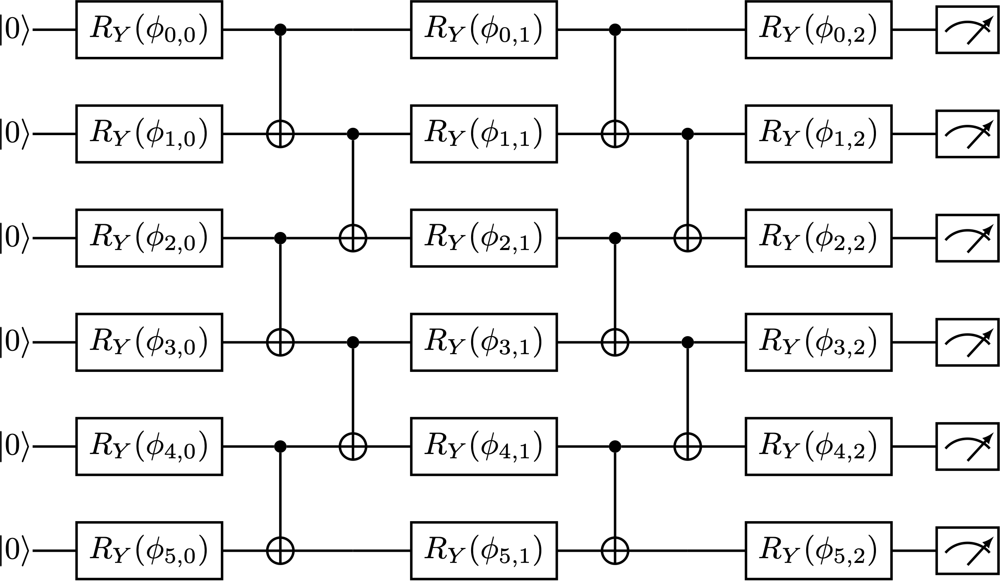
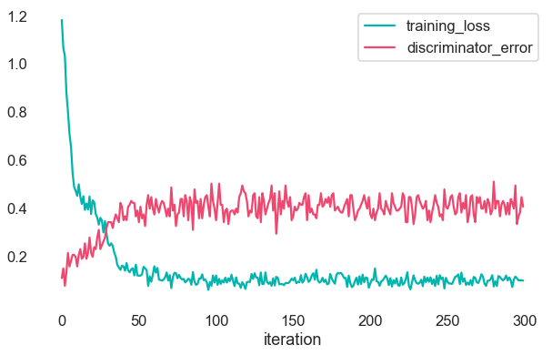

# Copyright


&copy; Copyright 2021 Rigetti & Co, Inc.

# What is a Born machine?

A Born machine is a quantum circuit consisting of three layers of parameterized one-qubit gates (`RY`) for rotation with two layers of two-qubit gates (`CNOT`) interspersed for entanglement.
Given training data, we attempt to learn the correct parameters to generate synthetic data that mimics the training data as closely as possible, where we measure "closely" by Sinkhorn divergence.
Here's a circuit schematic for a Born machine with 6 qubits:



Once training is complete, we assess the model fit by running a discriminator—a binary classifier, we use a Random Forest—on the samples generated during each training iteration and assess the discriminator error (1 - accuracy score).
Here's an example of what training loss and discriminator error might look like:



# What's all this then?

This repository contains a Python library implementing Born machines in `pyquil`.
It also includes an example and executable for training a Born machine on currency pair data as seen in _Quantum versus classical modelling in finance._[^1]

# HELP

```
$ poetry run experiment --help

NAME
    experiment - Run a currency pair experiment.

SYNOPSIS
    experiment USE_QVM SAVE_DIR <flags>

DESCRIPTION
    Given details about an experiment, construct a Born machine, gather true currency pair data, train that Born
    machine, save final samples, and report results.

POSITIONAL ARGUMENTS
    USE_QVM
        Type: bool
        Should we use a QVM?
    SAVE_DIR
        Type: str
        The directory in which to save all work.

FLAGS
    --qubits=QUBITS
        Type: typing.Union[int, typi...
        Default: 12
        Either the number of qubits to use or an explicit list of qubits.
    --use_reset=USE_RESET
        Type: bool
        Default: True
        Should we start with active RESET?
    --numshots=NUMSHOTS
        Type: int
        Default: 1000
        Number of shots collected each iteration.
    --num_currency_pairs=NUM_CURRENCY_PAIRS
        Type: int
        Default: 1
        The number of currency pairs to use.
    --num_samples=NUM_SAMPLES
        Type: int
        Default: 1000
        The number of currency pair samples to use for true data.
    --iterations=ITERATIONS
        Type: int
        Default: 300
        Training iterations to perform.
    --seed=SEED
        Type: int
        Default: 1729
        Seed for PRNG used for randomly initializing parameters for reproducibility.
    --qc_name=QC_NAME
        Type: str
        Default: 'Aspen-9'
        The name of a QPU to use (if `use_qvm` is false).

NOTES
    You can also use flags syntax for POSITIONAL ARGUMENTS
```

# Development Environment

We set the Python version with [`pyenv`](https://github.com/pyenv/pyenv); see the [`.python-version`](./.python-version) file.
We manage dependencies and the main entry point with [`poetry`](https://python-poetry.org/); see the [`pyproject.toml`](./pyproject.toml) file.
Specifically, be sure to run `poetry install` prior to attempting to run any experiments or any of the [`Makefile`](./Makefile) commands.

# References
[^1]: _Quantum versus classical generative modelling in finance_, Brian Coyle et. al., 2021 Quantum Sci. Technol. 6 024013, https://iopscience.iop.org/article/10.1088/2058-9565/abd3db
